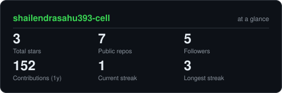
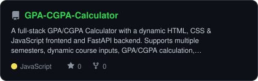
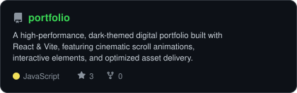
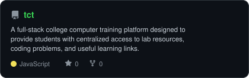
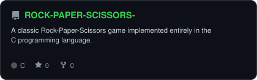

<div align="center">

<!-- Animated profile photo: fade + slide-down loop -->


<br>

<a href="https://github.com/shailendrasahu393-cell">
  
</a>

<br>

<a href="https://www.linkedin.com/in/shailendrasahu-/"></a>
<a href="https://github.com/shailendrasahu393-cell"></a>
<a href="https://leetcode.com/u/shailendra2007/"></a>
<a href="https://shailendrasahu.onrender.com/"></a>

<br><br>


</div>

---

## `~/` whoami

```console
$ cat about.txt
```

Hi, I'm **Shailendra Sahu**, a **B.Tech CSE student and aspiring Backend Engineer**.

I enjoy building applications, understanding how systems work behind the scenes, and improving my problem-solving skills through Data Structures and Algorithms.

- 🔭 Currently building projects with **Python, FastAPI, JavaScript and React**
- ⚙️ Learning **Backend Engineering, JWT Authentication, Databases and API Architecture**
- 🧠 Practicing **Data Structures & Algorithms**
- 🌱 Exploring **System Design, Scalable Systems and Distributed Systems**
- 🚀 Goal: Build reliable, scalable and impactful software systems
- 💡 Mindset: **Learn → Build → Break → Improve → Repeat**

<br>

<div align="center">

## `~/` toolbox


</div>

---

<div align="center">

## `~/` skill radar

<table>
<tr>
<td width="50%" align="center" valign="middle">

<!-- Self-rated skills: edit assets/skills.json -->
<picture>
  <source media="(prefers-color-scheme: dark)" srcset="assets/radar-dark.svg">
  <source media="(prefers-color-scheme: light)" srcset="assets/radar-light.svg">
  
</picture>

</td>
<td width="50%" align="center" valign="middle">

<!-- Real language distribution across public repositories -->
<picture>
  <source media="(prefers-color-scheme: dark)" srcset="assets/radar-langs-dark.svg">
  <source media="(prefers-color-scheme: light)" srcset="assets/radar-langs-light.svg">
  
</picture>

</td>
</tr>
</table>

</div>

---

<div align="center">

## `~/` contribution calendar

<!-- Generated automatically by Metrics workflow -->


<br><br>

<!-- Generated automatically by Snake workflow -->
<picture>
  <source media="(prefers-color-scheme: dark)" srcset="https://raw.githubusercontent.com/shailendrasahu393-cell/shailendrasahu393-cell/output/snake-dark.svg">
  <source media="(prefers-color-scheme: light)" srcset="https://raw.githubusercontent.com/shailendrasahu393-cell/shailendrasahu393-cell/output/snake.svg">
  
</picture>

</div>

---

<div align="center">

## `~/` the numbers

<!-- Generated in your own repository by scripts/cards.py -->
<picture>
  <source media="(prefers-color-scheme: dark)" srcset="assets/card-stats-dark.svg">
  <source media="(prefers-color-scheme: light)" srcset="assets/card-stats-light.svg">
  
</picture>

<br>


<br><br>


</div>

---

<div align="center">

## `~/` selected work

<!-- Repo cards are generated from assets/projects.json -->
<table>
<tr>
<td width="50%">
  <a href="https://github.com/shailendrasahu393-cell/GPA-CGPA-Calculator">
    <picture>
      <source media="(prefers-color-scheme: dark)" srcset="assets/card-GPA-CGPA-Calculator-dark.svg">
      <source media="(prefers-color-scheme: light)" srcset="assets/card-GPA-CGPA-Calculator-light.svg">
      
    </picture>
  </a>
</td>
<td width="50%">
  <a href="https://github.com/shailendrasahu393-cell/portfolio">
    <picture>
      <source media="(prefers-color-scheme: dark)" srcset="assets/card-portfolio-dark.svg">
      <source media="(prefers-color-scheme: light)" srcset="assets/card-portfolio-light.svg">
      
    </picture>
  </a>
</td>
</tr>
<tr>
<td width="50%">
  <a href="https://github.com/shailendrasahu393-cell/tct">
    <picture>
      <source media="(prefers-color-scheme: dark)" srcset="assets/card-tct-dark.svg">
      <source media="(prefers-color-scheme: light)" srcset="assets/card-tct-light.svg">
      
    </picture>
  </a>
</td>
<td width="50%">
  <a href="https://github.com/shailendrasahu393-cell/ROCK-PAPER-SCISSORS-">
    <picture>
      <source media="(prefers-color-scheme: dark)" srcset="assets/card-ROCK-PAPER-SCISSORS--dark.svg">
      <source media="(prefers-color-scheme: light)" srcset="assets/card-ROCK-PAPER-SCISSORS--light.svg">
      
    </picture>
  </a>
</td>
</tr>
</table>

<sub>

| project | focus | stack |
|---|---|---|
| **[GPA / CGPA Calculator](https://github.com/shailendrasahu393-cell/GPA-CGPA-Calculator)** | Dynamic GPA & CGPA calculation | `Python` `FastAPI` `Pydantic` `HTML` `CSS` `JavaScript` |
| **[Portfolio](https://github.com/shailendrasahu393-cell/portfolio)** | Interactive personal portfolio | `React` `Vite` `JavaScript` |
| **[TCT Lab Portal](https://github.com/shailendrasahu393-cell/tct)** | College training & learning resources | `JavaScript` `Web Development` |
| **[Rock Paper Scissors](https://github.com/shailendrasahu393-cell/ROCK-PAPER-SCISSORS-)** | Classic programming game | `C` |

</sub>

</div>

---

## `~/` currently learning

```text
Backend Engineering        █████████░  Learning
REST APIs                  ████████░░  Building
FastAPI                    ████████░░  Practicing
JWT Authentication         █████░░░░░  Exploring
Databases                  █████░░░░░  Exploring
System Design              ████░░░░░░  Learning
Distributed Systems        ███░░░░░░░  Learning
Scalable Systems           ███░░░░░░░  Learning
```

---

## `~/` future roadmap

```text
Python + Backend Fundamentals
            ↓
FastAPI + REST APIs
            ↓
Authentication + Databases
            ↓
Production-Ready Backend Projects
            ↓
System Design
            ↓
Scalable & Distributed Systems
            ↓
Strong Backend / Software Engineer 🚀
```

### Projects I want to build

- 🤖 AI-powered applications
- 🔐 Authentication and authorization systems
- 🗄️ Database-driven backend applications
- ⚡ Scalable REST APIs
- 🏗️ System Design projects
- 🌐 Distributed backend systems
- 🇮🇳 India-focused AI assistant
- ☁️ Cloud-deployed applications

---

<div align="center">

### `Keep Learning. Keep Building. Keep Improving. 🚀`

<sub>Made with ❤️ by <a href="https://github.com/shailendrasahu393-cell">Shailendra Sahu</a></sub>

</div>
